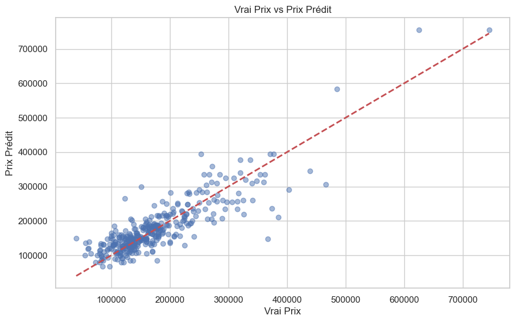
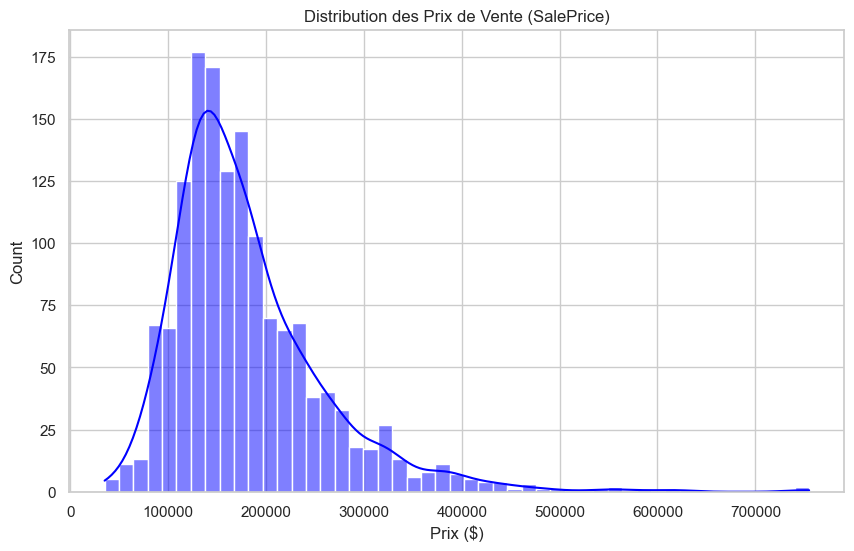

# 🏡 House Price Prediction (Iowa)
# 🏠 Iowa House Price Prediction


> **Un projet de Machine Learning pour prédire les prix de l'immobilier résidentiel à Ames, Iowa.**

---

## 📸 Aperçu des Résultats

Voici la performance actuelle de notre modèle **Decision Tree Regressor**.
L'objectif est d'aligner les points bleus sur la ligne rouge pointillée (prédiction parfaite).



*Comme on peut le voir, le modèle suit la tendance générale mais fait des erreurs sur les maisons très chères (valeurs aberrantes).*

---

## 📊 Analyse des Données (EDA)

Avant de prédire, nous avons analysé la distribution des prix. La plupart des maisons se situent entre **100k$ et 200k$**.



---

## 🛠️ Comment ça marche ? (Workflow)

Ce projet suit un pipeline Data Science standard :

1.  **Data Loading** : Chargement des données brutes (`train.csv`).
2.  **Feature Selection** : Sélection de 7 caractéristiques clés (Surface, Année, Chambres...).
    * `LotArea`, `YearBuilt`, `1stFlrSF`, `2ndFlrSF`, `FullBath`, `BedroomAbvGr`, `TotRmsAbvGrd`.
3.  **Splitting** : Séparation Train/Validation (80% / 20%).
4.  **Modeling** : Entraînement d'un `DecisionTreeRegressor`.
5.  **Evaluation** : Calcul de la MAE (Mean Absolute Error).

---

## 🚀 Comment lancer le projet

Clonez ce repo et lancez l'analyse vous-même :

```bash
# 1. Cloner le repo
# Si tu as choisi l'option 1
git remote add origin https://github.com/TON_PSEUDO/housing-price-prediction.git

# Ensuite, tu pousses tout :
git push -u origin main

# 2. Installer les dépendances
pip install -r requirements.txt

# 3. Lancer le script
python main.py